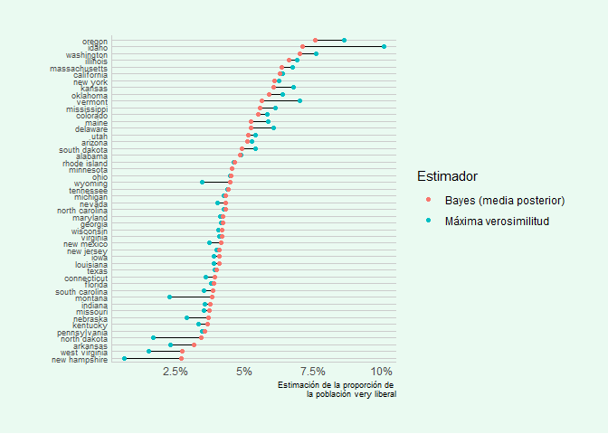

# Simple Hierarchical Modeling exercise

 This repo contains a solution to to exercise 21, chapter 2 from **Bayesian Data Analysis** book from Gelman *et al*. Electronic edition from the book can be found here:

 [Bayesian Data Analysis, Third edition](https://www.stat.columbia.edu/~gelman/book/BDA3.pdf)

## Problem description

The file `pew_research_center_june_elect_wknd_data.dta` has data from Pew Research Center polls taken during the 2008 election campaign. You can read these data into R using the `read.dta()` function (after first loading the `foreign` package into R). Your task is to estimate the percentage of the (adult) population in each state (excluding Alaska, Hawaii, and the District of Columbia) who label themselves as 'very liberal', following the general procedure that was used in Section 2.7 to estimate cancer rates, but using the binomial and beta rather than Poisson and gamma distributions. But you do not need to make maps; it will be enough to make scatterplots, plotting the estimate vs. Barack Obama's vote share in 2008 (data available at `2008ElectionResult.csv`, readable in R using `read.csv()`).  
Make the following four graphs on a single page:  
+ Graph proportion very liberal among the survey respondents in each state vs. Obama vote share—that is, a scatterplot using the two-letter state abbreviations (see state.abb()
in R).
+ Graph the Bayes posterior mean in each state vs. Obama vote share.
+ Repeat graphs (a) and (b) using the number of respondents in the state on the x-axis.  
This exercise has four challenges: first, manipulating the data in order to get the totals by state; second, estimating the parameters of the prior distribution; third, doing the Bayesian analysis by state; and fourth, making the graphs.

## Solution

Solution and R code can be found here: [Solution](https://jsnjuan.github.io/SimpleHierarchicalModeling/)

## Comparison between Bayes and Maximum likelihood estimators

Maximum likelihood estimators (MLE) are also calculated, in addition to Bayes estimators (BE) asked for. Then a comparison between both BE and MLE estimators is made. Conclusion in this exercise is that BE shows a regularization-like behavior, since estimators are more stable and with less variance that MLE, as shown in the following picture.

