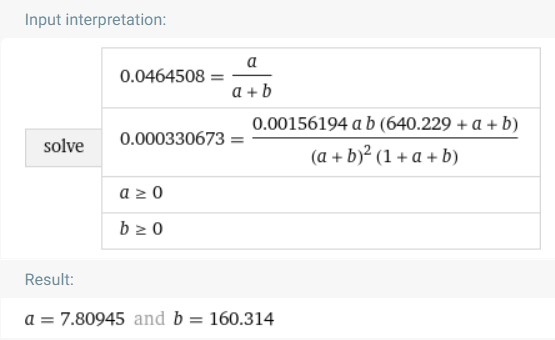

```{r setup, include=FALSE, message=FALSE}
knitr::opts_chunk$set(echo = TRUE)

library(Hmisc)
library(hrbrthemes)
library(kableExtra)
library(tidyverse)
library(invgamma)
library(datasets)

knitr::opts_chunk$set(echo = TRUE, error = TRUE)
format_table_salida <- function() {
  if (knitr::is_latex_output())
    "latex" else "html"
}

thm <- theme_ipsum_ps(grid="XY", axis="xy") + 
  theme(#axis.text.y=element_blank(), 
        panel.background = element_rect(fill = "#EAFAF1", colour = NA),
        plot.background = element_rect(fill = "#EAFAF1", colour = NA),
        legend.background = element_rect(fill = "#EAFAF1", colour = NA),
        legend.box.background = element_rect(fill = "#EAFAF1", colour = NA))

bg_green <- theme(panel.background = element_rect(fill = "#EAFAF1", colour = NA),
        plot.background = element_rect(fill = "#EAFAF1", colour = NA),
        legend.background = element_rect(fill = "#EAFAF1", colour = NA),
        legend.box.background = element_rect(fill = "#EAFAF1", colour = NA))

thm_dotplot <-  theme_ipsum_ps(grid="", axis="xy") +
  theme(axis.text.y = element_text(size = rel(.75)),
        axis.ticks.y = element_blank(),
        axis.title.x = element_text(size = rel(.75)),
        panel.grid.major.x = element_blank(),
        panel.grid.major.y = element_line(size = 0.25),
        panel.grid.minor.x = element_blank()) +
        bg_green
```


Let's first read the data we are going to work with:

```{r, message=FALSE}
# Reading poll data
poll_data <- foreign::read.dta("data/pew_research_center_june_elect_wknd_data.dta")
# Reading 2008 election results
elec_2008 <- read_csv('data/2008ElectionResult.csv') %>% 
  mutate(state=str_to_lower(state))

```

* Lets calculate and plot very liberal proportion among survey respondents against Obama vote share:

```{r, warning=FALSE, message=FALSE, fig.align='center'}
vl_prop <- poll_data %>% 
  # Excluding Alaska, Hawai, DC
  filter(state %nin% c('alaska', 'hawaii', 'washington dc')) %>%
  drop_na(ideo) %>% 
  mutate(vl = as.numeric(ideo == 'very liberal')) %>% 
  group_by(state) %>% 
  summarise(vl_p = sum(vl)/n())

vl_prop_ovs <- left_join(vl_prop, elec_2008, by='state')
vl_prop_ovs <- vl_prop_ovs %>% mutate(state_abb=state.abb[match(str_to_title(state), state.name)])

vl_prop_ovs

ggplot(vl_prop_ovs, aes(x = vl_p, y = vote_Obama_pct, label=state)) + 
  geom_point() + 
  geom_text(aes(label=state_abb), hjust=0.45, vjust=-0.25) + 
  labs(x ='Very liberal proportion', y='Obama vote share') + 
  scale_x_continuous(labels = function(x) paste0(x*100, "%")) +
  scale_y_continuous(labels = function(x) paste0(x, "%")) +
  thm
```

Following task is to calculate Bayes posterior mean, so we need to have an initial distribution. As depicted in book's example 2.7, one way to construct an initial distribution is [METHODOLOGY]

We have following equations that parameters must satisfy in order to:

\begin{align*}
E(nvl_j) &= \frac{n_j\alpha}{\alpha + \beta} \\
Var(nvl_j) &= \frac{n_j\alpha\beta(\alpha + \beta + n_j)}{ (\alpha + \beta)^2(\alpha + \beta+1)}
\end{align*}

Parameters of the previous system of equations are:

+ $nvl_j$ as number of survey respondents with a very liberal stance in state $j$.
+ $n_j$ number of surveys taken on $j$ state.

Rewriting the system in  terms of proportions, it results:

\begin{align*}
E\left(\frac{nvl_j}{n_j}\right) &= \frac{\alpha}{\alpha + \beta} \\
Var\left(\frac{nvl_j}{n_j}\right) &= \frac{\alpha\beta(\alpha + \beta + n_j)}{n_j(\alpha + \beta)^2(\alpha + \beta+1)}
\end{align*}

In this case, we should note that to construct proportion in the variance equation, we should divide by constant $n_j^2$ both sides, while 
$nvl_j$ remains as unknown parameter. Then we replace expected value and variance with equivalent sample values. Similarly, $n_j$ is replaced with sample mean (number of surveys by state in average). Following code calculates these values:


```{r, warning=FALSE, message=FALSE, fig.align='center'}
E_p <- conteo_edo %>% summarize( e_p = mean(n_very_liberal/n )  ) %>% pull(e_p)
E_n <- conteo_edo %>% pull(n) %>% mean()
Var_p <- conteo_edo %>% summarize( var_p = var(n_very_liberal/n)  ) %>% pull(var_p)
paste('E_p:', E_p)
paste('Var_p:', Var_p)
paste('E_n:', E_n)

```


[PENDING OF TRANSLATION]


of  Estima el porcentaje de la población de cada estado (excluyendo Alaska, Hawai, y DC)  que se considera *very liberal*, utilizando el estimador de máxima verosimilitud.


### _Solución_

*** 
<style>
div.blue { background-color: #EAFAF1; border-radius: 5px; padding: 10px;}
</style>
<div class = "blue">

Estimaremos el porcentaje de la población por máxima verosimilitud con el siguiente código:

```{r, warning=FALSE, message=FALSE, fig.align='center'}
conteo_edo <- poll_data %>% 
  # Excluimos los estados de Alaska, Hawai y DC
  filter(state %nin% c('alaska', 'hawaii', 'washington dc')) %>%
  drop_na(ideo) %>% 
  mutate(vl = as.numeric(ideo == 'very liberal')) %>% 
  #mutate(vl = replace_na(vl, 0)) %>% 
  group_by(state) %>% 
  summarise(n_very_liberal = sum(vl), n= n())


# Creamos la función de verosimilitud
crear_log_verosim <- function(n_very_liberal, n, ...){

  log_verosimilitud_pct <- function(pct){
    log_prob <- n_very_liberal * log(pct) + (n - n_very_liberal) * log(1 - pct)
    log_prob
  }
  log_verosimilitud_pct
}

# Calculamos el estimador de máxima verosimilitud de cada estado
conteo_edo <- conteo_edo %>% 
  mutate(ml_estim=map_dbl(
          pmap(., crear_log_verosim), 
          ~optimize(.x, c(0, 1), maximum = TRUE)[['maximum']]
          )
        ) %>%
  arrange(ml_estim)

conteo_edo %>% knitr::kable(caption = "Estimación por ml de la proporción 
                            de personas que se consideran -very liberal- 
                            por estado", digits=2,  format_table_salida(), escape = FALSE,
               booktabs = T) %>%
  kableExtra::kable_styling(latex_options = c("striped", "scale_down"),
                            bootstrap_options = c( "hover", "condensed"),full_width = FALSE)
```

</div>
*** 

  - Grafica en el eje *x* el número de encuestas para cada estado y en el eje *y* 
  la estimación de máxima verosimilitud. ¿Qué observas?
  

*** 
<style>
div.blue { background-color: #EAFAF1; border-radius: 5px; padding: 10px;}
</style>
<div class = "blue">
  

```{r, warning=FALSE, message=FALSE, fig.align='center'}
ggplot(conteo_edo, aes(x = n, y = ml_estim, label=state)) + 
  geom_point() + 
  geom_text(aes(label=ifelse((ml_estim>0.075)|
                               (ml_estim<0.025)|
                               (n>2000), 
                             as.character(state),'')),
            hjust=0.45,vjust=-0.25) + 
  labs(x = "Número de encuestas por estado", y = 'Estimador de máxima verosimilitud') + 
  scale_y_continuous(labels = function(x) paste0(x*100, "%")) +
  thm 
```

**Observaciones:** Podemos notar que las proporciones estimadas no superan el 10%. Idaho, Oregon y Washington (noroeste de EEUU) son aquellos con mayores proporciones estimadas de personas con ideología _very liberal_, mientras que New Hampshire, West Virginia, Montana y Arkansas cuentan con una proporción estimada menor. California parece ser un estado sobrerepresentado con 2,809 registros de encuestas, pues el promedio de encuestas por estado es de 640. la mayor variabilidad de las proporciones se encuentra en los estados con un menor número de encuestas.
</div>
*** 

  
  - Grafica en el eje *x* el porcentaje de votos que obtuvo Obama en la elección
  para cada estado y en el eje *y* la estimación de máxima verosimilitud. ¿Qué observas? (usa los datos *2008ElectionResult.csv*)

### _Solución_

*** 
<style>
div.blue { background-color: #EAFAF1; border-radius: 5px; padding: 10px;}
</style>
<div class = "blue">

```{r, warning=FALSE, message=FALSE, fig.align='center'}
conteo_edo2 <- left_join(conteo_edo, elec_2008, by='state')

ggplot(conteo_edo2, aes(x = vote_Obama_pct, y = ml_estim)) + 
  geom_point() + 
  geom_text(aes(label=ifelse((ml_estim>0.075)|
                               (ml_estim<0.025)|
                               (n>2000), 
                             as.character(state),'')),
            hjust=0.45,vjust=-0.25) + 
  geom_smooth(method = "loess", span = 1, method.args = list(degree = 2), 
              se = FALSE, size = 1, 
    color = "red") + 
  geom_smooth(method = "lm") + 
  labs(x = "% de votos que obtuvo Obama", y = 'Estimador de máxima verosimilitud') + 
  scale_y_continuous(labels = function(x) paste0(x*100, "%")) + 
  scale_x_continuous(labels = function(x) paste0(x, "%")) + 
  thm
```

**Observaciones:** Se observa que un buen ajuste a los datos puede estar dado por una relación no lineal en los datos. Un ajuste cuadrático se muestra por la línea en color rojo.  De igual manera, a efectos de comparación agregamos el ajuste lineal, el cual parece ser débil, pues la pendiente de dicho ajuste tiene un valor pequeño. El valor estimado de Idaho pareciera un valor al menos sobre-estimado, pues en estados como Oregon y Washington (con una proporción estimada alta de ideología _very liberal_) Obama contó con un porcentaje de votos de más del 50%, mientras que en Idaho obtuvo 36% de los votos, el cuarto estado con menos votos que tuvo Obama.

</div>
*** 
* Estima el mismo porcentaje usando inferencia bayesiana, en particular
la familia conjugada binomial-beta. Deberás estimar la proporción de manera 
independiente para cada estado, sin embargo, utilizarás la misma inicial a lo
largo de todos.
  - Para elegir los parámetros $\alpha$, $\beta$ de la inicial considera la media
  y varianza de la distribución predictiva posterior (que en este caso tiene
  distribución [Beta-Binomial](https://en.wikipedia.org/wiki/Beta-binomial_distribution))
  y empata la media y varianza observadas a sus valores esperados para después
  depejar $\alpha$ y $\beta$ (puedes usar [Wolfram alpha](https://www.wolframalpha.com/) para resolver).  
  - Utiliza la media posterior de cada estado como estimador puntual y repite las
  gráficas del inciso anterior.

**Nota:** Este proceso para obtener los parámetros de la inicial es razonable para
este ejercicio, sin embargo, un modelo jerárquico sería la manera de formalizar 
este acercamiento y se estudiará en próximas materias.


*** 
<style>
div.blue { background-color: #EAFAF1; border-radius: 5px; padding: 10px;}
</style>
<div class = "blue">

### _Solución_

Primero construyamos una distribución inicial de los datos. EL método será igual al utilizado en el ejemplo  *2.7* citado en el planteamiento del ejercicio. En este caso tenemos lo siguiente:

\begin{align*}
E(nvl_j) &= \frac{n_j\alpha}{\alpha + \beta} \\
Var(nvl_j) &= \frac{n_j\alpha\beta(\alpha + \beta + n_j)}{ (\alpha + \beta)^2(\alpha + \beta+1)}
\end{align*}

En las fórmulas anteriores, $nvl_j$ denota el número de personas encuestadas que manifestaron ser de una posición _very liberal_ en el estado $j$, mientras que $n_j$ denota el número de encuestas realizadas en el mismo estado. Como estamos modelando en términos de proporciones, las ecuaciones anteriores quedan como sigue:

\begin{align*}
E\left(\frac{nvl_j}{n_j}\right) &= \frac{\alpha}{\alpha + \beta} \\
Var\left(\frac{nvl_j}{n_j}\right) &= \frac{\alpha\beta(\alpha + \beta + n_j)}{n_j(\alpha + \beta)^2(\alpha + \beta+1)}
\end{align*}


Notemos que en el caso de la varianza, para construir la proporción dividimos ambos lados entre $n_j^2$ (en este caso como una constante), pues $nvl_j$ es el parámetro de la distribución que buscamos. El valor esperado y la varianza los reemplazaremos con los valores muestrales. De igual manera, el valor de $n_j$ a la derecha lo reemplazaremos con la media muestral, es decir, el número de encuestas promedio que se realizaron en cada estado. Calculemos con R dichos parámetros:

```{r, warning=FALSE, message=FALSE, fig.align='center'}
E_p <- conteo_edo %>% summarize( e_p = mean(n_very_liberal/n )  ) %>% pull(e_p)
E_n <- conteo_edo %>% pull(n) %>% mean()
Var_p <- conteo_edo %>% summarize( var_p = var(n_very_liberal/n)  ) %>% pull(var_p)
paste('E_p:', E_p)
paste('Var_p:', Var_p)
paste('E_n:', E_n)

```

De lo anterior, el sistema a resolver queda como sigue:
\begin{align*}
0.04645082 &= \frac{\alpha}{\alpha + \beta} \\
0.0003306732 &= \frac{\alpha\times\beta(\alpha + \beta + 640.2292)}{640.2292(\alpha + \beta)^2(\alpha + \beta+1)}
\end{align*}

Resolviendo el sistema en Wolphram Alpha obtenemos el siguiente resultado:

```sh
Ecuaciones insertadas en https://www.wolframalpha.com/calculators/system-equation-calculator
0.04645082 = (a) / (a + b)
0.0003306732 = (a b * (a + b + 640.2292))/(640.2292 (a + b)^2*( a + b + 1 ) )
a >=0
b >=0
```

<center>



</center>


\begin{align*}
\alpha &= 7.80945 \\
\beta &= 160.314
\end{align*}

Con lo anterior, ya tenemos los valores para $\alpha$ y $\beta$ de la distribución inicial $Beta$. El siguiente gráfico muestra la función de densidad de una $Beta$ con estos parámetros y la función de densidad empírica de los datos (distribución de las proporciones $nvl_j/n_j$). Podemos notar que el ajuste a los datos es bueno, cumple con tener la mayor concentración en valores de la proporción de 10% o menos, una de las características que se observan en los datos.

```{r, warning=FALSE, message=FALSE, fig.align='center'}
alpha <- 7.80945
beta <-  160.314

datos_reales <- tibble(prop = conteo_edo$n_very_liberal/conteo_edo$n, 
                       dist = "Datos reales")

datos_reales %>% 
  ggplot(aes(x = prop, fill = dist)) +
  geom_density(alpha = 0.5, position = "identity") + 
  geom_line(stat = "function", fun = dbeta, 
            mapping = aes(color='Beta'),
            args = list(shape1=alpha, shape2=beta), 
            size=1, inherit.aes = F, show.legend = T) +
  scale_x_continuous(limits = c(0, 0.15), 
                     labels = function(x) paste0(x*100, "%")
                     ) + 
  labs(color = '', fill='', x='Proporción',  y = 'Densidad') + thm
  

```

Ahora calcularemos el ajuste de cada estado. Para esto, usaremos resultados de análisis conjugado Beta-Binomial, que nos dicen que si nuestro modelo será $nvl_j \sim Binomial (n_j, p)$, con una inicial $Beta(\alpha, \beta)$ para $p$, entonces la posterior tendrá una distribución $Beta(nvl_j+\alpha, n_j-nvl_j+\beta)$. El estimador que usaremos será la media posterior de cada estado.

```{r, warning=FALSE, message=FALSE, fig.align='center'}

gen_media_post <- function(n_very_liberal, n, ...){
  mean(rbeta(50000, n_very_liberal + alpha,
             n - n_very_liberal + beta))
}

conteo_edo <- conteo_edo %>% 
  mutate(#median_post =  
         #qbeta(0.5, shape1 = n_very_liberal + alpha, 
         #shape2 = n - n_very_liberal + beta),
         media_post = pmap_dbl(.,gen_media_post))
```

Rehacemos los gráficos anteriores:

```{r, warning=FALSE, message=FALSE, fig.align='center'}
ggplot(conteo_edo, aes(x = n, y = media_post, label=state)) + 
  geom_point() + 
  geom_text(aes(label=ifelse((ml_estim>0.076)|
                               (ml_estim<0.025)|
                               (n>2000),
                             as.character(state),'')),
            hjust=0.45,vjust=-0.25) + 
  labs(x = "Número de encuestas por estado", 
       y = 'Estimador de Bayes') + 
  scale_y_continuous(labels = function(x) paste0(x*100, "%")) + thm
```

Es posible notar que, en general, el rango de las estimaciones de las proporciones ahora es de entre el 2.5% y poco más del 7%, es decir, las nuevas proporciones sufrieron una reducción en su rango. Este efecto es similar a la regularización cuando se habla de modelos de aprendizaje de máquina.


```{r, warning=FALSE, message=FALSE, fig.align='center'}
conteo_edo2 <- left_join(conteo_edo, elec_2008, by='state')

ggplot(conteo_edo2, aes(x = vote_Obama_pct, y = media_post)) + 
  geom_point() + 
  geom_text(aes(label=ifelse((ml_estim>0.075)|
                               (ml_estim<0.025)|
                               (n>2000), 
                             as.character(state),'')),
            hjust=0.45,vjust=-0.25) + 
  geom_smooth(method = "loess", span = 1, method.args = list(degree = 2), 
              se = FALSE, size = 1, 
    color = "red") + 
  geom_smooth(method='lm') + 
  #geom_smooth(method = "lm") + 
  #theme_ipsum_ps(grid="XY", axis="y") + 
  labs(x = "% de votos que obtuvo Obama", y = 'Estimador de Bayes') + 
  scale_y_continuous(labels = function(x) paste0(x*100, "%")) + 
  scale_x_continuous(labels = function(x) paste0(x, "%")) + thm

```

De igual manera, aunque aún persiste el patrón cuadrático, podemos notar que ahora parecen haber más valores altos de proporciones relacionados con altos porcentajes de votos obtenidos por Obama. Esto se puede apreciar en el ajuste lineal de los datos, el cual parece tener una mayor pendiente, a comparación del ajuste de las proporciones obtenidas por máxima verosimilitud.

Por último, comparemos ambos estimadores. Para esto construiremos una gráfica de puntos.

```{r, warning=FALSE, message=FALSE, fig.align='center'}
comp_est <- conteo_edo %>% select(state, ml_estim, media_post) %>% 
  gather(key = "estimador", value = "prop", ml_estim, media_post)

ggplot(comp_est, aes(x=prop, 
                     y=fct_reorder2(state, estimador=='media_post', prop, .desc=FALSE))) +
        geom_line(aes(group = state)) +
        geom_point(aes(color = estimador)) +
  scale_x_continuous(labels = function(x) paste0(x*100, "%")) + 
  labs(x = 'Estimación de la proporción de 
       la población very liberal', y='', color = 'Estimador') + 
  scale_colour_manual(
    values = c('#F8766D', '#00bfc4'), 
  labels = c("Bayes (media posterior)", "Máxima verosimilitud")) + 
  thm_dotplot
```

Es notable el ajuste que tuvo el estado de Idaho, el cual pasó de estar cerca del 10% a un valor más cercano al 7%. Este efecto no solo se observó en valores altos de la proporción, sino también en proporciones pequeñas. Para muestra tenemos New Hampshire, que pasó de un valor de .06%  a 2.6%. En términos del rango de valores, las estimaciones de las proporciones obtenidas por máxima verosimilitud van del 0 al 10%, mientras que, las estimaciones de Bayes se encuentran entre  2.5%  y 7.5%, es decir, el intervalo de valores posibles se redujo prácticamente a la mitad. Podemos concluir que incorporar información en la inicial tiene un efecto de correción de valores un tanto extremos, similar a la regularización de aprendizaje de máquina. Esto podemos interpretarlo como una buena propiedad de los estimadores de Bayes, pues podemos pensar que estas estimaciones son robustas a valores extremos en los datos.

</div>
*** 


